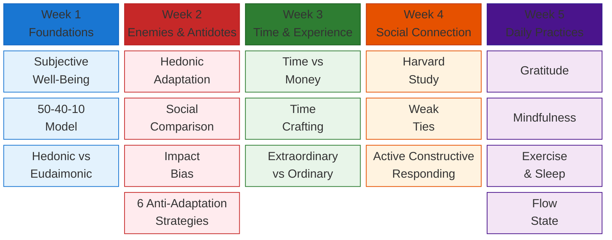
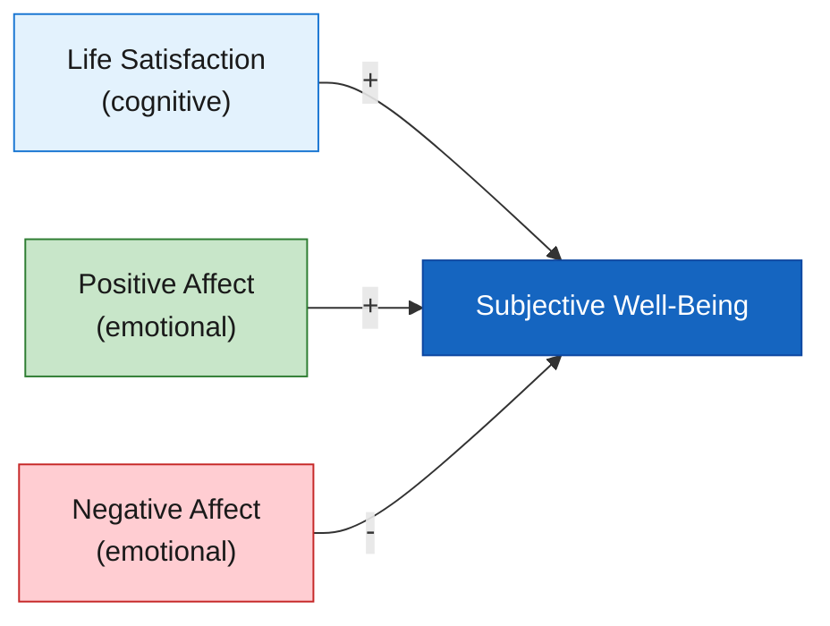
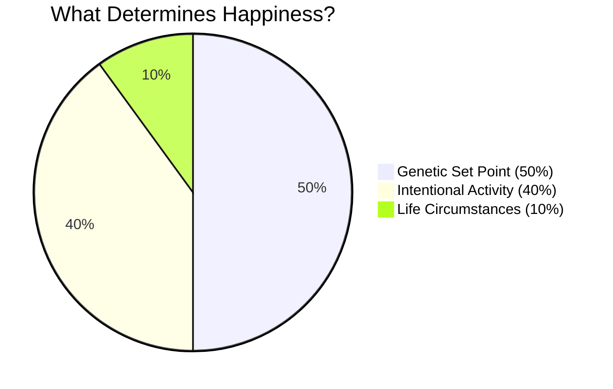

# The Science of Happiness - Visual Knowledge Atlas

A comprehensive visual study guide for **MGMT 258: The Science of Happiness** at UCLA Anderson School of Management. 33 interactive Mermaid diagrams distilling 5 weeks of research-backed insights into one navigable page.

**[View Live](https://happiness-midterm.vercel.app)**

---

## Course Map

## Key Formula

## The Happiness Pie

## What's Inside

| Section | Topics | Diagrams |
|---------|--------|----------|
| 0. Master Overview | Full course concept map + timeline | 2 |
| 1. What is Happiness? | SWB, 50-40-10, Hedonic vs Eudaimonic | 4 |
| 2. Three Enemies | Hedonic Adaptation, Social Comparison, Impact Bias | 5 |
| 3. Anti-Adaptation Toolkit | 6 strategies, savoring with breaks | 2 |
| 4. Time & Happiness | Time vs Money, Time Crafting, free time curve | 4 |
| 5. Extraordinary vs Ordinary | Socioemotional Selectivity Theory | 1 |
| 6. Social Connection | Harvard Study, weak ties, reaching out | 3 |
| 7. Active Constructive Responding | ACR 2x2 grid, social media | 2 |
| 8. Gratitude | Journal, letter, workplace gratitude | 3 |
| 9. Mind & Body | Mindfulness, exercise, sleep, flow | 5 |
| 10. Exam Cheat Visual | Summary + exam strategy | 2 |

**Total: 33 Mermaid diagrams** across **11 sections**

## Built With

- [Mermaid.js v11](https://mermaid.js.org/) - 33 diagrams (mindmap, flowchart, pie, sequence, timeline, xychart, quadrant)
- Vanilla HTML/CSS/JS - zero dependencies, single file
- [Vercel](https://vercel.com) - deployment

---

*UCLA Anderson School of Management, Winter 2026*
